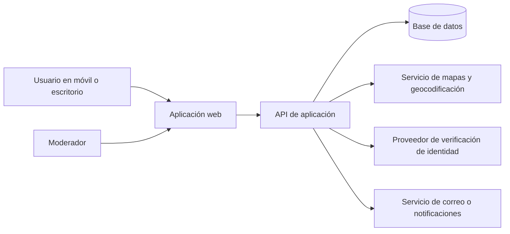

# Arquitectura propuesta

## Principios

- Construir una aplicación web simple y modular.
- Usar servicios gestionados para reducir complejidad operativa.
- Separar datos públicos, datos de cuenta y datos de moderación.
- No almacenar imágenes ni números de documentos oficiales en la base de datos de la aplicación.

## Arquitectura lógica

## Stack sugerido

| Capa | Elección inicial | Motivo |
|---|---|---|
| Frontend | Next.js con TypeScript | Rápido para web móvil, formularios y páginas públicas. |
| Estilos | Tailwind CSS | Permite crear una interfaz coherente con poco código. |
| Backend | Rutas de servidor de Next.js o API independiente | Mantiene el MVP simple. |
| Base de datos | PostgreSQL | Robusta y adecuada para filtros, relaciones y geodatos. |
| Autenticación | Servicio gestionado con correo | Evita implementar credenciales desde cero. |
| Mapas | Proveedor con geocodificación y mapas | Permite mapa, búsqueda y cálculo de distancia. |
| Almacenamiento | Servicio de objetos para fotos opcionales | Aislado de la base de datos. |
| Verificación | Proveedor externo de identidad | Reduce exposición a documentos oficiales y mejora la trazabilidad. |

## Módulos de aplicación

1. **Identidad y acceso:** registro, sesión, perfiles y roles.
2. **Verificación:** comunicación con proveedor, estado y trazabilidad mínima.
3. **Planes y eventos:** creación, edición, publicación, asistencia y favoritos.
4. **Ubicación:** geocodificación, mapa y filtros por cercanía.
5. **Interacción:** comentarios y notificaciones.
6. **Moderación:** reportes, cola de revisión, ocultación y suspensiones.
7. **Administración:** categorías, reglas y métricas básicas.

## Modelo de datos inicial

| Entidad | Campos principales |
|---|---|
| Usuario | id, correo, nombre visible, ciudad, fecha de creación, rol, estado. |
| Perfil | usuario_id, foto, intereses, biografía opcional. |
| Verificación | usuario_id, proveedor, referencia externa, estado, fecha, consentimiento de normas. |
| Evento | id, creador_id, título, categoría, descripción, fecha, lugar, coordenadas, estado. |
| Quedada | id, evento_id opcional, organizador_id, título, fecha, punto de encuentro, capacidad, estado. |
| Asistencia | quedada_id, usuario_id, estado, fecha. |
| Comentario | autor_id, evento_id o quedada_id, contenido, fecha, estado de moderación. |
| Reporte | autor_id, tipo de objeto, objeto_id, motivo, estado, moderador_id. |
| Auditoría | actor_id, acción, objeto, fecha, metadatos mínimos. |

## Flujo de verificación

1. El usuario solicita crear una quedada.
2. Si no está verificado, se le deriva al proveedor de verificación.
3. El proveedor devuelve únicamente resultado y referencia técnica.
4. La aplicación marca al usuario como verificado o rechaza la acción.
5. Se guarda un registro de auditoría sin copiar el documento.

## Seguridad mínima

- HTTPS en todas las comunicaciones.
- Control de acceso por rol en cada operación.
- Validación de entradas en servidor.
- Límite de peticiones para registro, comentarios y creación de planes.
- Cifrado de secretos y claves fuera del código fuente.
- Copias de seguridad de la base de datos.
- Registro de errores y alertas de actividad anómala.
