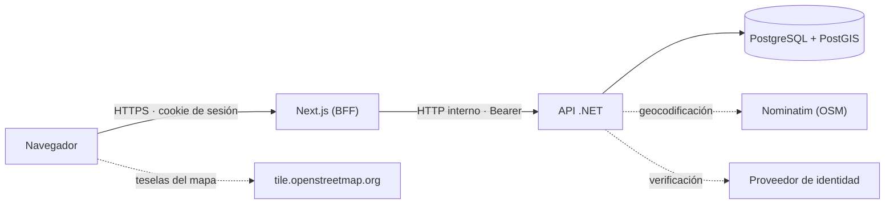
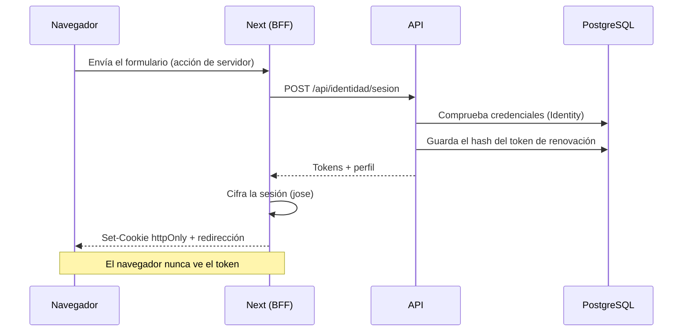
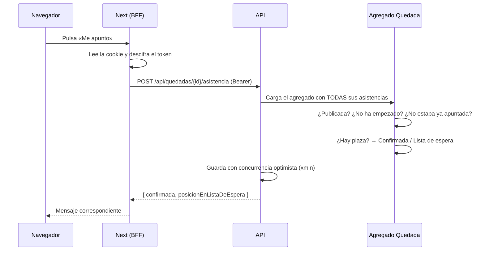
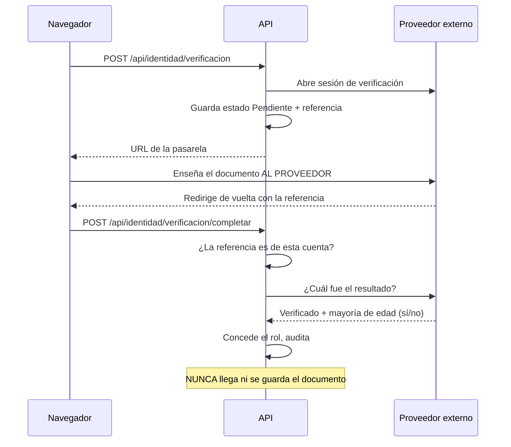

# Arquitectura

Cómo está construido PlanVibe y por qué. Este documento describe el sistema **tal como es**; las
decisiones concretas y sus alternativas descartadas están en los [ADR](adr/).

---

## Principios

1. **Las reglas de negocio no dependen de nada.** El proyecto de dominio no referencia bases de
   datos, HTTP ni frameworks. Si una regla necesita EF Core para funcionar, está en el sitio
   equivocado.
2. **Recoger solo los datos necesarios.** Especialmente en la verificación de identidad: la
   plataforma comprueba quién eres sin guardar tu documento.
3. **Separar datos públicos, datos de cuenta y datos de moderación.** Se traduce en tres esquemas
   de base de datos distintos.
4. **Las credenciales no llegan al navegador.** El token vive en el servidor de Next, dentro de una
   cookie cifrada.
5. **Fallar al arrancar antes que funcionar mal.** Si falta una clave de firma o es demasiado
   corta, la aplicación no levanta.

---

## Vista general



Las líneas discontinuas son servicios externos: si fallan, la aplicación sigue funcionando con
menos prestaciones. Si falla la geocodificación, el punto se coloca a mano en el mapa; si falla la
verificación, no se pueden publicar planes nuevos, pero todo lo demás funciona.

### Por qué un BFF y no llamadas directas del navegador

El servidor de Next hace de intermediario entre el navegador y la API. Cuesta algo de código
adicional, y a cambio:

- **El token nunca llega al navegador.** Un ataque de XSS podría hacer peticiones en nombre de la
  persona, pero no llevarse la sesión a otro sitio ni reutilizarla desde fuera.
- **No hace falta CORS** entre navegador y API: el navegador solo habla con su propio origen.
- **La política de seguridad de contenido puede ser estricta**, con `connect-src 'self'`.
- **La API no queda expuesta** a internet: en Docker solo escucha en la red interna.

Ver [ADR-003](adr/003-bff-en-next.md).

---

## Capas del backend

```
PlanVibe.Api             → HTTP, autenticación, límites de peticiones, composición
        ↓ depende de
PlanVibe.Infrastructure  → PostgreSQL, Identity, JWT, mapas, auditoría, notificaciones
        ↓ depende de
PlanVibe.Application     → Casos de uso, validación y puertos (interfaces)
        ↓ depende de
PlanVibe.Domain          → Agregados, objetos de valor e invariantes. Sin dependencias.
```

Las flechas apuntan siempre hacia dentro. El dominio no sabe que existe una base de datos; la capa
de aplicación declara qué necesita (`IRepositorioDeQuedadas`, `IProveedorDeVerificacion`) y la
infraestructura lo implementa. Esa inversión es lo que permite probar los casos de uso sin base de
datos y cambiar de proveedor de mapas tocando una sola clase.

### Dominio

Los agregados son la frontera de consistencia: todo lo que se modifica en una transacción pertenece
a uno solo.

| Agregado | Responsabilidad | Invariantes que protege |
|---|---|---|
| `Usuario` | Perfil, roles y estado de verificación | Edad mínima, quién puede organizar, anonimización al eliminar |
| `Quedada` | El plan y sus asistencias | Capacidad, lista de espera, quién puede cancelar, privacidad de la dirección |
| `Categoria` | Catálogo de administración | Nombre y clave válidos |

`Asistencia` es una entidad hija de `Quedada` y **solo** se modifica a través de ella. Esa
restricción es lo que garantiza que nunca se supere la capacidad: no hay ningún camino en el código
que pueda insertar una asistencia sin pasar por la comprobación de plazas.

Toda la aritmética de plazas vive dentro del agregado. Un caso de uso no puede contar asistentes
por su cuenta y decidir si cabe una persona más.

### Aplicación

Un tipo por caso de uso, separando comandos (modifican) de consultas (solo leen):

- Los **comandos** cargan el agregado, le piden que haga algo y guardan. Ejemplo:
  `CrearQuedadaManejador`.
- Las **consultas** van directas a la base de datos y devuelven la forma exacta que la pantalla
  necesita, sin materializar agregados. Ejemplo: `BuscarPlanesManejador`.

Esa separación evita que una lista de veinte planes cargue las asistencias de los veinte para
acabar mostrando un contador.

La validación se aplica con un **decorador** registrado en el contenedor de dependencias
(`ManejadorConValidacion`), no con una llamada dentro de cada manejador. Así es imposible olvidarse
de validar un comando nuevo: lo aplica el contenedor, no la disciplina de quien programa.

### Infraestructura

| Puerto | Implementación | Notas |
|---|---|---|
| `IRepositorioDeUsuarios`, `IRepositorioDeQuedadas` | EF Core sobre PostgreSQL | Cargan el agregado completo |
| `IConsultasDeQuedadas` | EF Core con proyecciones | Lado de lectura, con `AsNoTracking` |
| `IUnidadDeTrabajo` | Transacción de EF Core | Publica los eventos **después** de confirmar |
| `IServicioDeCredenciales` | ASP.NET Core Identity | El dominio no sabe qué es un hash |
| `IEmisorDeTokens` | JWT propio con renovación rotativa | Detecta reutilización de tokens |
| `IProveedorDeVerificacion` | **Simulado** en desarrollo | Se niega a registrarse fuera de desarrollo |
| `IServicioDeGeocodificacion` | Nominatim con caché en memoria | Sin clave de API |
| `IRegistroDeAuditoria` | Tabla `auditoria.entradas` | Misma transacción que la acción |

---

## Frontend

Next.js con App Router. La mayor parte son **componentes de servidor**: la página llega al
navegador con los datos dentro, sin estado de carga ni petición desde el cliente. Es lo que hace
que la primera pantalla se pinte rápido en una conexión móvil (RNF-02).

Solo son componentes de cliente los que necesitan interacción real:

| Componente | Por qué necesita el navegador |
|---|---|
| `BotonDeAsistencia` | Muestra el resultado de apuntarse sin recargar |
| `MapaDelPunto`, `MapaDePlanes` | Leaflet manipula el DOM directamente |
| `FormularioDeAcceso`, `FormularioDeQuedada` | Errores de validación por campo |

Las mutaciones se hacen con **acciones de servidor**, no con endpoints propios. Next comprueba el
origen de la petición automáticamente, así que no hay que gestionar un token CSRF a mano, y los
formularios funcionan incluso antes de que cargue el JavaScript.

### Capa de sesión

```
lib/sesion.ts        Cookie httpOnly cifrada con jose. Guarda tokens y perfil.
lib/api-servidor.ts  Cliente de la API. Añade el token y lo renueva solo cuando caduca.
lib/datos.ts         Lecturas que hacen las páginas.
lib/acciones/        Acciones de servidor: registro, sesión, publicar, apuntarse.
```

`api-servidor.ts` renueva el token de acceso de forma transparente cuando le quedan menos de 30
segundos. La persona no ve nunca una sesión cortada a mitad de un formulario.

---

## Flujos

### Inicio de sesión



### Apuntarse a un plan



Que el agregado se cargue entero no es un descuido: es lo que impide una condición de carrera. Un
`SELECT COUNT` seguido de un `INSERT` permitiría que dos peticiones simultáneas leyeran «queda 1
plaza» y ambas entraran. La segunda barrera es la marca `xmin` de PostgreSQL: si dos transacciones
tocan la misma quedada a la vez, la segunda falla y se traduce en un 409.

### Verificación de organizador



Dos detalles con intención:

- El resultado se **consulta al proveedor**, no se acepta el que llega por la barra de direcciones.
  Aceptarlo permitiría a cualquiera concederse el rol de organizador.
- Se comprueba que la referencia corresponde a esta cuenta. Sin ello, alguien podría reclamar el
  resultado de la verificación de otra persona.

---

## Base de datos

PostgreSQL 17 con PostGIS. Tres esquemas:

| Esquema | Contenido | Motivo de la separación |
|---|---|---|
| `app` | Usuarios, quedadas, asistencias, categorías | Datos de la aplicación |
| `identidad` | Credenciales, roles y tokens de sesión | Permite dar permisos distintos |
| `auditoria` | Traza de acciones sensibles | En producción: solo lectura e inserción |

La búsqueda por cercanía se apoya en una columna `geography` **calculada por PostgreSQL** a partir
de la latitud y la longitud, con índice GIST. Al ser generada, no puede quedar desincronizada con
las coordenadas: no hay forma de escribirla a mano.

El detalle completo está en [06-modelo-de-datos.md](06-modelo-de-datos.md).

---

## Seguridad aplicada

| Medida | Dónde |
|---|---|
| Contraseñas con hash de Identity y bloqueo tras 5 fallos | `InyeccionDeDependencias.AgregarIdentidad` |
| Tokens de acceso de 15 minutos, sin margen de reloj | `Program.cs`, `OpcionesDeJwt` |
| Renovación rotativa con detección de reutilización | `EmisorDeTokens` |
| Tokens de renovación guardados como hash SHA-256 | `TokenDeRenovacion` |
| Tiempo constante al validar credenciales | `ServicioDeCredenciales` |
| Límite de peticiones por endpoint | `Program.cs` |
| Cabeceras de seguridad | `CabecerasDeSeguridad`, `next.config.mjs` |
| Política de seguridad de contenido sin `unsafe-inline` en scripts | `next.config.mjs` |
| Errores sin detalles internos | `ManejadorDeExcepciones` |
| Cookie de sesión cifrada y `httpOnly` | `lib/sesion.ts` |
| Auditoría en la misma transacción que la acción | `RegistroDeAuditoria` |
| Vulnerabilidades de dependencias como error de compilación | `Directory.Build.props` |

El análisis completo, con lo que **no** está cubierto todavía, está en
[09-modelo-de-amenazas.md](09-modelo-de-amenazas.md).

---

## Decisiones registradas

| ADR | Decisión |
|---|---|
| [001](adr/001-arquitectura-limpia-con-ddd.md) | Arquitectura limpia con DDD táctico |
| [002](adr/002-autenticacion-propia-con-jwt.md) | Autenticación propia con JWT y renovación rotativa |
| [003](adr/003-bff-en-next.md) | BFF en Next en lugar de llamadas directas |
| [004](adr/004-postgis-para-cercania.md) | PostGIS con columna calculada para la búsqueda por cercanía |
| [005](adr/005-nominatim-como-proveedor-de-mapas.md) | Leaflet y Nominatim como proveedor de mapas |
| [006](adr/006-verificacion-sin-almacenar-documentos.md) | Verificación de identidad sin almacenar documentos |
| [007](adr/007-cqrs-ligero-sin-mediador.md) | CQRS ligero sin biblioteca mediadora |
