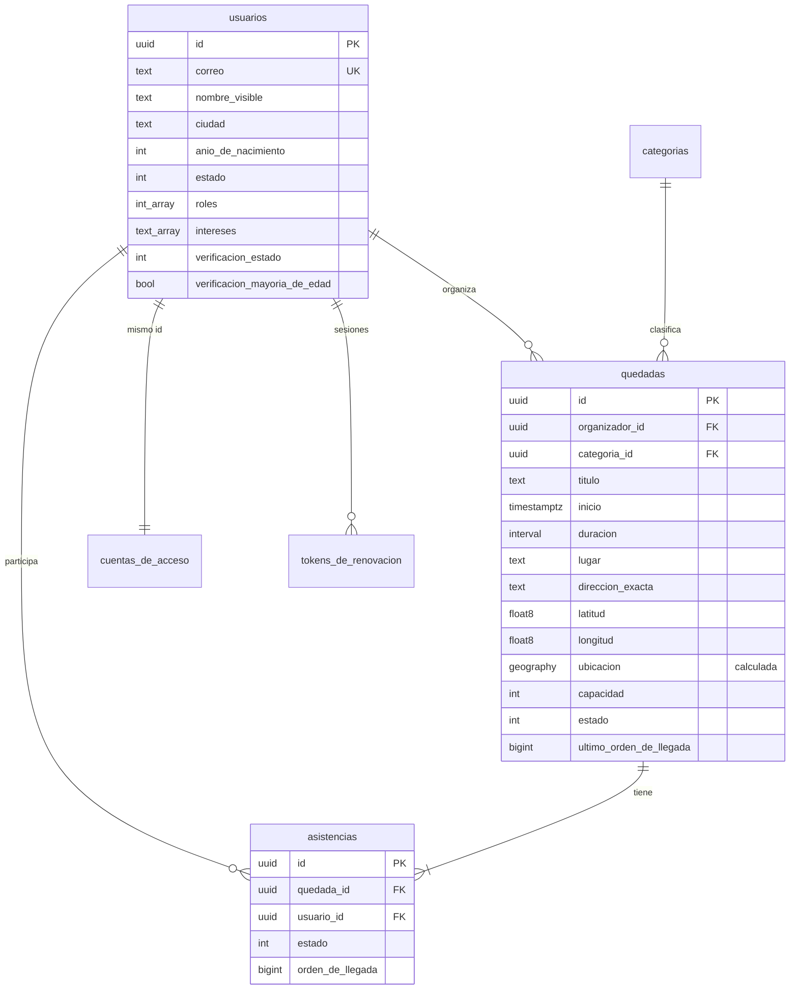

# Modelo de datos

PostgreSQL 17 con PostGIS. Este documento describe el esquema, por qué está así y cómo se cambia.

---

## Esquemas

| Esquema | Contenido | Motivo |
|---|---|---|
| `app` | Usuarios, quedadas, asistencias, categorías | Datos de la aplicación |
| `identidad` | Credenciales, roles y tokens de sesión | Permite permisos distintos a los de negocio |
| `auditoria` | Traza de acciones sensibles | En producción: solo lectura e inserción |

La separación aplica el principio de dividir datos públicos, de cuenta y de moderación descrito en
[02-arquitectura.md](02-arquitectura.md). Hoy los tres los usa el mismo usuario de base de datos;
en producción hay que separarlos (ver [09-modelo-de-amenazas.md](09-modelo-de-amenazas.md)).

---

## Diagrama



---

## Decisiones con consecuencias

### Identificadores UUID versión 7

Todos los identificadores son `Guid.CreateVersion7()`, que incorpora marca de tiempo. Los valores
consecutivos quedan ordenados, así que las inserciones van al final del índice en lugar de
fragmentarlo como haría un GUID aleatorio.

Además, se usan **identificadores fuertemente tipados** (`UsuarioId`, `QuedadaId`): pasar por error
un identificador de quedada donde se espera uno de usuario lo rechaza el compilador.

### El correo se guarda normalizado

`CorreoElectronico` pasa a minúsculas y recorta espacios en el constructor. Con eso, el índice
único basta para impedir que `Lucia@Example.com` y `lucia@example.com` se conviertan en dos cuentas.

### Solo el año de nacimiento

No hay columna de fecha de nacimiento. Basta el año para comprobar la edad mínima de acceso, y la
mayoría de edad para organizar la confirma el proveedor de verificación como un sí/no. Es
minimización de datos aplicada al esquema, no solo a la política.

### Roles e intereses como arrays

`roles integer[]` e `intereses text[]` viven en la propia fila del usuario en lugar de en tablas de
relación. Son pocos, se leen siempre junto al usuario y no tienen datos propios: una tabla aparte
añadiría una unión a cada consulta sin aportar nada.

> **Ojo con los arrays en EF Core.** Necesitan un `ValueComparer`. Sin él, EF compara la colección
> por referencia y **no detecta que ha cambiado**: revocar un rol no generaría ningún `UPDATE` y el
> cambio se perdería en silencio. Están configurados en `UsuarioConfiguracion` y
> `QuedadaConfiguracion`, con el porqué al lado.

### La columna `ubicacion` la calcula PostgreSQL

```sql
ubicacion geography(Point,4326)
  GENERATED ALWAYS AS (ST_SetSRID(ST_MakePoint(longitud, latitud), 4326)::geography) STORED
```

Con índice GIST. Al ser generada no puede desincronizarse de las coordenadas. Ver
[ADR-004](adr/004-postgis-para-cercania.md).

### Índice único sobre (quedada, usuario)

```sql
CREATE UNIQUE INDEX ix_asistencias_quedada_usuario ON app.asistencias (quedada_id, usuario_id);
```

Es la última barrera contra una doble inscripción. Aunque dos peticiones lleguen exactamente a la
vez y ambas superen la comprobación del agregado, la segunda choca con el índice.

Por eso `Asistencia.Reactivar` reutiliza la fila de quien se retiró y volvió a apuntarse, en lugar
de insertar una nueva: una sola fila por persona y quedada.

### Concurrencia optimista con `xmin`

Las tres raíces de agregado usan la columna de sistema `xmin` de PostgreSQL como marca de
concurrencia. Cambia sola en cada `UPDATE`, así que no hay que mantener un número de versión.

Si dos transacciones modifican la misma quedada a la vez, la segunda falla al guardar y
`UnidadDeTrabajo` lo traduce en un `ConflictoException`, que la API devuelve como 409.

### Orden de llegada, no marca de tiempo

La lista de espera se ordena por `orden_de_llegada`, un contador por quedada, y no por la fecha de
solicitud. Dos personas pueden apuntarse en el mismo milisegundo; el contador no empata nunca.

El contador **nunca decrece**, ni siquiera cuando alguien se retira: quien vuelve a apuntarse va al
final de la cola, que es lo justo.

---

## Tablas

### `app.usuarios`

| Columna | Tipo | Notas |
|---|---|---|
| `id` | uuid | Clave primaria. Compartida con `identidad.cuentas_de_acceso` |
| `correo` | varchar(254) | Único, normalizado en minúsculas |
| `nombre_visible` | varchar(60) | No tiene que ser el nombre legal |
| `ciudad` | varchar(80) | Opcional |
| `biografia` | varchar(300) | Opcional |
| `anio_de_nacimiento` | integer | Solo el año |
| `intereses` | text[] | Máximo 12 |
| `roles` | integer[] | Acumulativos |
| `estado` | integer | 1 activa · 2 suspendida · 3 eliminada |
| `verificacion_*` | varios | Ver [ADR-006](adr/006-verificacion-sin-almacenar-documentos.md) |
| `version_normas_aceptada` | varchar(40) | Qué versión aceptó, para poder demostrarlo |

### `app.quedadas`

| Columna | Tipo | Notas |
|---|---|---|
| `id` | uuid | Clave primaria |
| `organizador_id` | uuid | Referencia a `usuarios` |
| `categoria_id` | uuid | Referencia a `categorias` |
| `titulo` | varchar(120) | |
| `descripcion` | varchar(2000) | |
| `inicio` | timestamptz | Siempre UTC |
| `duracion` | interval | |
| `lugar` | varchar(120) | Público |
| `referencia` | varchar(200) | Pública |
| `direccion_exacta` | varchar(200) | **Solo se devuelve a quien tiene plaza confirmada** |
| `latitud`, `longitud` | double precision | |
| `ubicacion` | geography(Point,4326) | Calculada, índice GIST |
| `es_lugar_publico` | boolean | Declaración del organizador, auditable |
| `capacidad` | integer | Entre 2 y 500 |
| `normas` | text[] | Máximo 8 |
| `estado` | integer | 1 publicada · 2 cancelada · 3 finalizada · 4 oculta |
| `ultimo_orden_de_llegada` | bigint | Contador para la lista de espera |

La restricción de la dirección exacta **no está en la base de datos**: la aplica el agregado en
`Quedada.DireccionExactaVisiblePara`. Está ahí para que ninguna vista pueda saltársela por olvido.

### `app.asistencias`

| Columna | Tipo | Notas |
|---|---|---|
| `id` | uuid | |
| `quedada_id` | uuid | Único junto con `usuario_id` |
| `usuario_id` | uuid | |
| `estado` | integer | 1 confirmada · 2 en lista de espera · 3 retirada |
| `orden_de_llegada` | bigint | Ordena la lista de espera |

### `identidad.tokens_de_renovacion`

| Columna | Tipo | Notas |
|---|---|---|
| `hash_del_token` | varchar(64) | **SHA-256 en hexadecimal, nunca el valor en claro** |
| `familia` | uuid | Agrupa los tokens de un mismo inicio de sesión |
| `usado_en` | timestamptz | Si aparece un token ya usado, se revoca la familia entera |
| `revocado_en` | timestamptz | |

### `auditoria.entradas`

| Columna | Tipo | Notas |
|---|---|---|
| `actor_id` | uuid | Nulo si la acción la hizo el sistema |
| `accion` | varchar(80) | Formato `area.accion` |
| `metadatos` | jsonb | **Mínimos y sin datos personales** |

Las filas no se modifican ni se borran desde la aplicación. Su retención se define en la política
de datos y se aplica con un proceso aparte: borrar una cuenta no debe destruir la traza de las
decisiones de moderación que la afectaron.

---

## Migraciones

Se generan con EF Core y se revisan siempre antes de confirmarlas.

```bash
dotnet ef migrations add NombreDescriptivo --project backend/src/PlanVibe.Infrastructure --startup-project backend/src/PlanVibe.Api --output-dir Persistencia/Migraciones
```

Para ver el SQL sin aplicarlo:

```bash
dotnet ef migrations script --project backend/src/PlanVibe.Infrastructure --startup-project backend/src/PlanVibe.Api
```

**En desarrollo** se aplican solas al arrancar la API.

**En producción no.** Son un paso explícito del despliegue, por dos motivos: si escalan varias
instancias, todas intentarían migrar a la vez; y un despliegue fallido puede dejar el esquema a
medias sin que nadie lo esté mirando.

Las migraciones tienen su propio `.editorconfig` que desactiva las reglas de estilo: son código
generado y se regeneran enteras, así que cualquier corrección manual desaparecería.

---

## Datos iniciales

Al arrancar en desarrollo se siembran las cinco categorías del piloto, comprobando antes si ya
existen para no duplicarlas ni pisar cambios de administración.

No se siembran usuarios ni planes de ejemplo: la base de datos arranca vacía y el recorrido de la
sección 5 de [05-puesta-en-marcha.md](05-puesta-en-marcha.md) crea datos reales.
